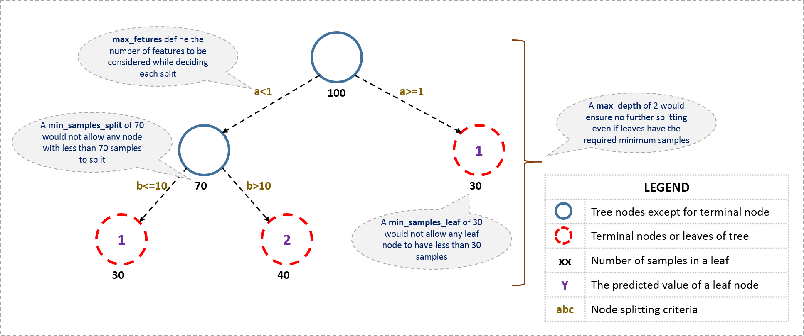

*作者: [Quan Chen](https://github.com/chenquan )*


# XGBoost调优指南

## 一. XGBoost介绍

XGBoost算法可以给预测模型带来能力的提升。它具有很多优势：

**正则化**

- 标准GBM的实现没有像XGBoost这样的正则化步骤。正则化对减少过拟合也是有帮助的。
- 实际上，XGBoost以“正则化提升(regularized boosting)”技术而闻名。

**并行处理**

- XGBoost可以实现并行处理，相比GBM有了速度的飞跃。
-  xgboost的并行是在特征粒度上的。我们知道，决策树的学习最耗时的一个步骤就是对特征的值进行排序（因为要确定最佳分割点），xgboost在训练之前，预先对数据进行了排序，然后保存为block结构，后面的迭代中重复地使用这个结构，大大减小计算量。这个block结构也使得并行成为了可能，在进行节点的分裂时，需要计算每个特征的增益，最终选增益最大的那个特征去做分裂，那么各个特征的增益计算就可以开多线程进行。 
-  可并行的近似直方图算法。树节点在进行分裂时，我们需要计算每个特征的每个分割点对应的增益，即用贪心法枚举所有可能的分割点。当数据无法一次载入内存或者在分布式情况下，贪心算法效率就会变得很低，所以xgboost还提出了一种可并行的近似直方图算法，用于高效地生成候选的分割点。 
- XGBoost 也支持Hadoop实现。

**高度的灵活性**

- XGBoost 允许用户定义自定义优化目标和评价标准
- 它对模型增加了一个全新的维度，所以我们的处理不会受到任何限制。

**缺失值处理**

- XGBoost内置处理缺失值的规则。
- 用户需要提供一个和其它样本不同的值，然后把它作为一个参数传进去，以此来作为缺失值的取值。XGBoost在不同节点遇到缺失值时采用不同的处理方法，并且会学习未来遇到缺失值时的处理方法。

**剪枝**

- 当分裂时遇到一个负损失时，GBM会停止分裂。因此GBM实际上是一个贪心算法。

- XGBoost会一直分裂到指定的最大深度(max_depth)，然后回过头来剪枝。如果某个节点之后不再有正值，它会去除这个分裂。这种做法的优点，当一个负损失（如-2）后面有个正损失（如+10）的时候，就显现出来了。GBM会在-2处停下来，因为它遇到了一个负值。但是XGBoost会继续分裂，然后发现这两个分裂综合起来会得到+8，因此会保留这两个分裂。

**内置交叉验证**

- XGBoost允许在每一轮boosting迭代中使用交叉验证。因此，可以方便地获得最优boosting迭代次数。
- GBM使用网格搜索，只能检测有限个值。

**在已有的模型基础上继续**

- XGBoost可以在上一轮的结果上继续训练。这个特性在某些特定的应用上是一个巨大的优势。
  sklearn中的GBM的实现也有这个功能，两种算法在这一点上是一致的。

总的来说GBM的参数可以被归为三类：

- **树参数：** 调节模型中每个决定树的性质

- **Boosting参数：** 调节模型中boosting的操作

- **其他模型参数：** 调节模型总体的各项运作


  

***图 决策树的一般结构***


**宏观参数**

- `booster[默认gbtree]`
- 选择每次迭代的模型，有两种选择：
  
  - gbtree：基于树的模型
  
  - gbliner：基于线性的模型
- `silent[默认0]`(不推荐使用)
  - 当这个参数值为1时，静默模式开启，不会输出任何信息。
  - 一般这个参数就保持默认的0，因为这样能帮我们更好地理解模型。
- `verbosity` [默认值= 1]
  - 打印消息的详细程度。有效值为0（静默），1（警告），2（信息），3（调试）。有时，XGBoost会尝试根据启发式来更改配置，该显示为警告消息。如果出现意外行为，请尝试增加详细程度的值。
- `nthread[默认值为最大可能的线程数]`
  - 这个参数用来进行多线程控制，应当输入系统的核数。
  - 如果你希望使用CPU全部的核，那就不要输入这个参数，算法会自动检测它。
- `disable_default_eval_metric` [默认= 0]
  - 标记以禁用默认指标。设置为> 0禁用。
- `num_pbuffer` [由XGBoost自动设置，无需由用户设置]
  - 预测缓冲区的大小，通常设置为训练实例数。缓冲区用于保存最后提升步骤的预测结果。
- `num_feature` [由XGBoost自动设置，无需由用户设置]
  - 用于增强的特征尺寸，设置为特征的最大尺寸


**提升器（Booster）参数：在每一步中引导单个的加速器（Booster）（树/回归）**

> 尽管有两种booster可供选择，我这里只介绍`tree booster`，因为它的表现远远胜过`linear booster`，所以linear booster很少用到。


1. `num_boosting_rounds`
这是生成的最大树的数目，也是最大的迭代次数。
2. `learning_rate(或eta)[默认0.3]`
和GBM中的 learning rate 参数类似。
通过减少每一步的权重，可以提高模型的鲁棒性。
典型值为0.01-0.2。
3. `min_child_weight[默认1]`
决定最小叶子节点样本权重和。
和GBM的 min_child_leaf 参数类似，但不完全一样。XGBoost的这个参数是最小样本权重的和，而GBM参数是最小样本总数。
这个参数用于避免过拟合。当它的值较大时，可以避免模型学习到局部的特殊样本。
但是如果这个值过高，会导致欠拟合。这个参数需要使用CV来调整。
4. `max_depth[默认6]`
和GBM中的参数相同，这个值为树的最大深度。
这个值也是用来避免过拟合的。max_depth越大，模型会学到更具体更局部的样本。
需要使用CV函数来进行调优。
典型值：3-10
5. `max_leaf_nodes`
树上最大的节点或叶子的数量。
可以替代max_depth的作用。因为如果生成的是二叉树，一个深度为n的树最多生成n2n^2n 
2 个叶子。
如果定义了这个参数，GBM会忽略max_depth参数。
6. `gamma[默认0]`
在节点分裂时，只有分裂后损失函数的值下降了，才会分裂这个节点。Gamma指定了节点分裂所需的最小损失函数下降值。
这个参数的值越大，算法越保守。这个参数的值和损失函数息息相关，所以是需要调整的。
7. `max_delta_step[默认0]`
这参数限制每棵树权重改变的最大步长。如果这个参数的值为0，那就意味着没有约束。如果它被赋予了某个正值，那么它会让这个算法更加保守。
通常，这个参数不需要设置。但是当各类别的样本十分不平衡时，它对逻辑回归是很有帮助的。
这个参数一般用不到，但是你可以挖掘出来它更多的用处。
8. `subsample[默认1]`
和GBM中的subsample参数一模一样。这个参数控制对于每棵树，随机采样的比例。
减小这个参数的值，算法会更加保守，避免过拟合。但是，如果这个值设置得过小，它可能会导致欠拟合。
典型值：0.5-1
9. `colsample_bytree[默认1]`
和GBM里面的max_features参数类似。用来控制每棵随机采样的列数的占比(每一列是一个特征)。
典型值：0.5-1
10. `colsample_bylevel[默认1]`
用来控制树的每一级的每一次分裂，对列数的采样的占比。
我个人一般不太用这个参数，因为subsample参数和colsample_bytree参数可以起到相同的作用。但是如果感兴趣，可以挖掘这个参数更多的用处。
11. `lambda[默认1]`
权重的L2正则化项。(和Ridge regression类似)。
这个参数是用来控制XGBoost的正则化部分的。虽然大部分数据科学家很少用到这个参数，但是这个参数在减少过拟合上还是可以挖掘出更多用处的。
12. `alpha[默认1]`
权重的L1正则化项。(和Lasso regression类似)。
可以应用在很高维度的情况下，使得算法的速度更快。
13. `scale_pos_weight[默认1]`
在各类别样本十分不平衡时，把这个参数设定为一个正值，可以使算法更快收敛。


 **学习目标参数**

这个参数用来控制理想的优化目标和每一步结果的度量方法。

- objective[默认reg:linear]
  这个参数定义需要被最小化的损失函数。最常用的值有：
  binary:logistic 二分类的逻辑回归，返回预测的概率(不是类别)。
  multi:softmax 使用softmax的多分类器，返回预测的类别(不是概率)。
  在这种情况下，你还需要多设一个参数：num_class(类别数目)。
  multi:softprob 和multi:softmax参数一样，但是返回的是每个数据属于各个类别的概率。
- eval_metric[默认值取决于objective参数的取值]
  对于有效数据的度量方法。
  对于回归问题，默认值是rmse，对于分类问题，默认值是error。
  典型值有：
  - rmse 均方根误差
  
  - mae 平均绝对误差
  
  - logloss 负对数似然函数值
  
  -  二分类错误率(阈值为0.5)
  
  - merror 多分类错误率
  
  - mlogloss 多分类logloss损失函数
  
  - auc 曲线下面积


- seed(默认0)
  随机数的种子
  设置它可以复现随机数据的结果，也可以用于调整参数
  

如果你之前用的是Scikit-learn,你可能不太熟悉这些参数。但是有个好消息，python的XGBoost模块有一个sklearn包，XGBClassifier。这个包中的参数是按sklearn风格命名的。会改变的函数名是：

-  num_boosting_rounds -> n_estimators 
- eta -> learning_rate
- lambda -> reg_lambda
- alpha -> reg_alpha

**调优步骤**

我们会使用和GBM中相似的方法。需要进行如下步骤：

1.  选择较高的学习速率(learning rate)。一般情况下，学习速率的值为0.1。但是，对于不同的问题，理想的学习速率有时候会在0.05到0.3之间波动。选择对应于此学习速率的理想决策树数量。XGBoost有一个很有用的函数“cv”，这个函数可以在每一次迭代中使用交叉验证，并返回理想的决策树数量。

2. 对于给定的学习速率和决策树数量，进行决策树特定参数调优(max_depth, min_child_weight, gamma, subsample, colsample_bytree)。在确定一棵树的过程中，我们可以选择不同的参数，待会儿我会举例说明。

3. xgboost的正则化参数的调优。(lambda, alpha)。这些参数可以降低模型的复杂度，从而提高模型的表现。

4. 降低学习速率，确定理想参数。


## 二.XGBoost案例

### 基于Sklearn接口的Xgb案例

```python
import xgboost as xgb
import pandas as pd
from sklearn.model_selection import train_test_split
from sklearn.metrics import r2_score,regression

X =....
y =....
train_X, valid_X, train_y, valid_y = train_test_split(X, y, test_size=0.333, random_state=2019)   # 分训练集和验证集

regre= xgb.XGBRegressor(max_depth=10,
			learning_rate=0.01,
			n_estimators=2000,
			silent=True,
			objective='reg:squarederror',
			nthread=-1,
			gamma=0,
			min_child_weight=1,
			max_delta_step=0,
			subsample=0.85,
			colsample_bytree=0.7,
			colsample_bylevel=1,
			reg_alpha=0,
			reg_lambda=1,
			scale_pos_weight=1,
			seed=2019,
			missing=None)
regre.fit(train_X, train_y, eval_metric='r2', verbose=True, eval_set=[(valid_X, valid_y)], early_stopping_rounds=30)
# 这个verbose主要是调节系统输出的，如果设置成10,便是每迭代10次就有输出。
# 注意我们这里eval_metric=‘error’便是准确率。这里面并没有accuracy命名的函数，网上大多例子为auc，我这里特意放了个error。 xgboost没有直接使用效果最好的树作为模型的机制，这里采用最大树深限制的方法，目的是获取刚刚early_stopping效果最好的，实测性能可以
y_pred = xlf.predict(valid_X, ntree_limit=regre.best_ntree_limit)
auc_score = r2_score(valid_y, y_pred)# 计算R^2
```

### GridSearch

这是一种调参手段；**穷举搜索**：在所有候选的参数选择中，通过循环遍历，尝试每一种可能性，表现最好的参数就是最终的结果。其原理就像是在数组里找最大值。（为什么叫网格搜索？以有两个参数的模型为例，参数a有3种可能，参数b有4种可能，把所有可能性列出来，可以表示成一个3*4的表格，其中每个cell就是一个网格，循环过程就像是在每个网格里遍历、搜索，所以叫grid search）

其实这个就跟我们常用的遍历是一样的。建议大家使用sklearn里面的GridSearch函数，简洁速度快。


```python
parameters = {
              'max_depth': [5, 10, 15, 20, 25],
              'learning_rate': [0.01, 0.02, 0.05, 0.1, 0.15],
              'n_estimators': [500, 1000, 2000, 3000, 5000],
              'min_child_weight': [0, 2, 5, 10, 20],
              'max_delta_step': [0, 0.2, 0.6, 1, 2],
              'subsample': [0.6, 0.7, 0.8, 0.85, 0.95],
              'colsample_bytree': [0.5, 0.6, 0.7, 0.8, 0.9],
              'reg_alpha': [0, 0.25, 0.5, 0.75, 1],
              'reg_lambda': [0.2, 0.4, 0.6, 0.8, 1],
              'scale_pos_weight': [0.2, 0.4, 0.6, 0.8, 1]

}

regre = xgb.XGBRegressor(max_depth=10,
			learning_rate=0.01,
			n_estimators=2000,
			silent=True,
			objective='reg:squarederror',
			nthread=-1,
			gamma=0,
			min_child_weight=1,
			max_delta_step=0,
			subsample=0.85,
			colsample_bytree=0.7,
			colsample_bylevel=1,
			reg_alpha=0,
			reg_lambda=1,
			scale_pos_weight=1,
			seed=1440,
			missing=None)
			
# 有了gridsearch我们便不需要fit函数
gsearchCV = GridSearchCV(regre, param_grid=parameters, scoring='r2', cv=3)
gsearchCV.fit(train_X, train_y)

print("Best score: %0.3f" % gsearchCV.best_score_)
print("Best parameters set:")
best_parameters = gsearchCV.best_estimator_.get_params()
for param_name in sorted(parameters.keys()):
    print("\t%s: %r" % (param_name, best_parameters[param_name]))
```


