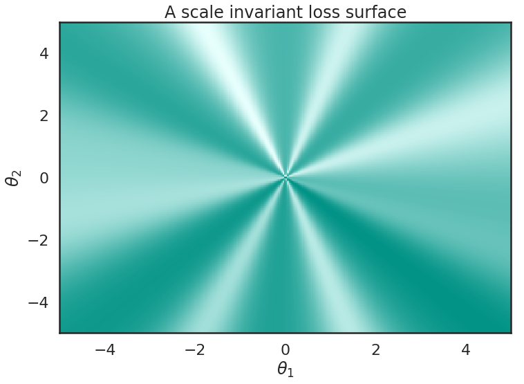

昨天，我读到了一篇有趣的文章，内容令人困惑，即在使用批处理归一化训练神经网络时可以使用成倍增长的学习率时间表：

- 李志远和Sanjeev Arora（2019）[深度学习的指数学习进度表](https://arxiv.org/abs/1910.07454)

本文提供了这种可重分属性的理论见解和经验证明。

## 尺度不变性

这样做的原因归结为以下事实：批量归一化使神经网络的损失函数按比例缩放-按常数缩放权重不会更改批量归一化网络的输出或损失。事实证明，单独使用此属性可能会导致某些出乎意料且可能对优化有用的属性。我将使用2D玩具示例，通过这篇文章来说明尺度不变损失函数的某些属性-以及它们的梯度下降轨迹：

  

在这里，我画了一个具有尺度不变性的损失函数。损耗的值仅取决于角度，而不取决于权重向量的大小。从原点向外的沿任何径向线的损耗值是恒定的。尺度不变的简单后果是（论文的引理1）

1. 该函数的梯度始终与参数向量的当前值正交，并且
2. 您离原点越远，渐变的幅度就越小。这可能不太直观，但请考虑函数在原点周围的圆周上的行为。函数是相同的，但是随着半径的增加，将相同的函数拉伸到更大的圆上会变胖，因此其梯度会减小。

这是一个有点混乱的颤动图，显示了上面函数的梯度：

由于原点周围的梯度会爆炸，所以颤动图很乱。但是您也许可以看到渐变如何变得越来越大-并且保持与值本身垂直。

因此，想象一下在这样的损失表面上进行香草梯度下降（没有动量，重量衰减，固定的学习速率）。由于斜率始终垂直于参数的当前值，因此根据毕达哥拉斯定理，参数向量的范数随每次迭代而增加。因此，梯度下降使您远离原点。但是，权重向量不会完全爆炸到无穷大，因为随着权重向量的增长，梯度也会变得越来越小，因此它会在某个点稳定下来。这里是一个梯度下降通道看起来像坐标$开始（ - 0.7，0.7）$： （-0.7，0.7）（-0.7，0.7）：

实际上，您实际上看不到它，但是优化类型卡在其中，并且不再移动。有趣的是，如果添加权重衰减，会发生什么，这与在权重上添加L2正则化器相同：

我们可以看到，一旦轨迹即将陷入局部最小值，权重衰减会将其拉回到原点，该原点就是梯度变大的地方。反过来，这会扰乱轨迹，经常将其推出当前的局部最小值。因此，从某种意义上说，我们可以开始建立直觉，即尺度不变损失函数上的权重衰减充当一种学习速率调整。

实际上，本文得出的结论是两件事之间的对等：

- 体重衰减且学习率恒定，并且
- 没有体重下降，学习率呈指数增长

在下面的图中，我显示了学习率呈指数增长的轨迹，该轨迹与我之前显示的随着体重下降而显示的轨迹相等。这没有体重下降，并且它的学习率持续增长：

我们可以看到轨迹爆炸，并且很快超出了此动画的范围。这如何等于重量衰减轨迹？好吧，从损失函数的角度来看，权重向量的大小无关紧要，并且我们只关心从原点观察时的角度。事实证明，如果您查看这些角度，则两个轨迹是相同的。为了说明这一点，我使用定理2.1中的归一化公式将这一轨迹投影回与重量衰减相同的幅度。我得到的确与上面的轨迹非常相似：

一段时间后，轨迹开始以不同的方式工作，我认为这可能是由于我在玩具示例的实现中积累了数字误差。我可能可以解决此问题，但是我不确定是否值得付出努力。作者展示了更多令人信服的经验证据，表明这可以在人们真正想要优化的真实，复杂的神经网络损失中发挥作用。

您可以认为我在上面所做的这种重新规范化是“不断缩小”损失情况，以跟上指数爆炸参数。我试图在下面说明这一点：

在左侧的图中，我显示了具有恒定学习率的原始的，权重下降的梯度下降。在右边的图上，我显示了等效轨迹，学习速率呈指数增长，并且没有权重衰减，并且还根据定理2.1添加了恒定缩放以抵消参数范数的爆炸。我们可以看到，尤其是从最初开始，从原点看，两条路径的行为相同。然后它们的工作方式有所不同，我认为这可能是可以解决的数字精度问题。

该论文在动量存在的情况下也表现出类似的效果，如果有兴趣的话，请阅读论文中的细节。

## 摘要

我认为这种观察非常酷，并且可能会更好地理解Batchnorm和其他权重标准化方案的工作机制。这也解释了为什么权重衰减与权重归一化方案相结合会导致相对稳健的梯度下降方案，其中恒定的学习率效果很好。